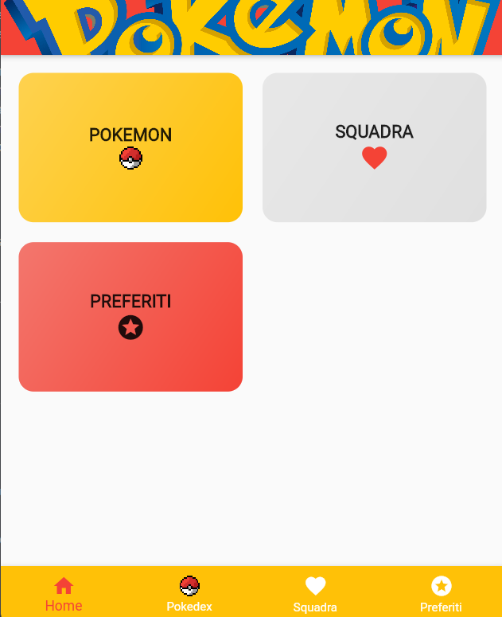
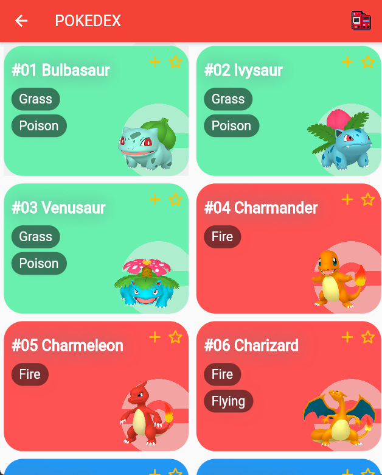
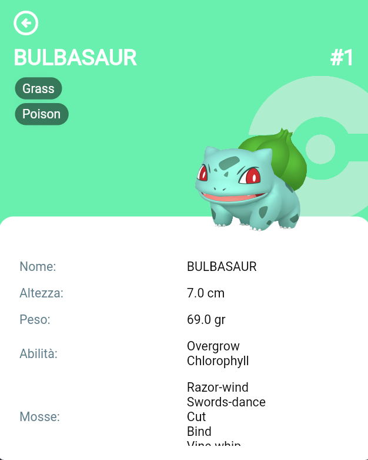
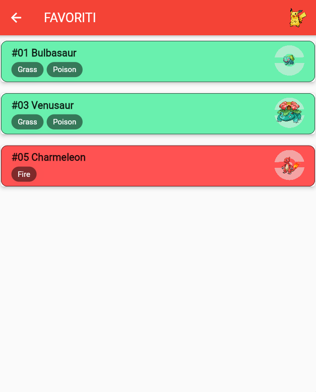
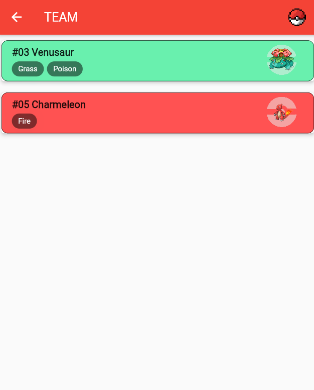
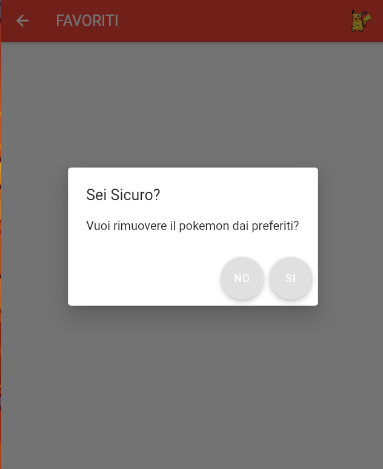

# Introduzione

## Informazioni Progetto

Nome: **Giorgia Roselli**,  
Matricola: **324273**,  
Titolo: **Pokedex**.

## Breve Introduzione

L'applicazione è stata sviluppata utilizzando il framework Flutter ed è composta da diverse schermate.
All'avvio l'applicazione mostra la possibilità di accedere alle 3 diverse sezioni:

- La prima sezione è quella principale è riporta ad un elenco di pokémon selezionabili, presi dall'[api](https://pokeapi.co/). Cliccando sulla scheda del pokémon di proprio interesse sarà possibile accedere a una schermata dove saranno riportati maggiori dettagli dello stesso;
- La seconda sezione riguarderà i pokemon inseriti nella propria squadra, con un massimo di 6 pokémon;
- Infine la terza ed ultima sezione è dedicata ai pokémon preferiti senza vincoli di quantità.
  Sarà possibile inserire i pokémon ai preferiti e nella squadra dalla schermata appartenente alla prima sezione.

## Casi d'uso

L'utente all'avvio dell'applicazione avrà la possibilità di cliccare 3 diverse sezioni. Il medesimo inoltre potrà arrivare alle stesse sezione mediante la BottomNavigationBar.
Quando l'utente arriverà nella sezione principale, si ritroverà una lista di pokémon, con la possibilità di selezionarli per avere maggiori informazioni (come altezza, peso, abilità, mosse, etc), aggiungerli alla lista dei preferiti e infine la possibilità di aggiungerli anche alla propria squadra; quest'ultimo con un massimo di sei. Qual'ora si provasse ad aggiungere un settimo pokémon alla squadra questo non sarà possibile e verrà visualizzato a schermo un messaggio dedicato.
Se l'utente clicca la sezione riguardante la squadra andrà in una schermata con un lista dei pokémon appartenenti ad essa. Utilizzando il widget Dismissible facendo lo swap da destra verso sinistra ci sarà la possibilità di eliminare il pokémon dalla squadra.
Se l'utente clicca la sezione riguardante i preferiti andrà in una schermata con un lista dei pokémon appartenenti ad essa. Utilizzando il widget Dismissible facendo lo swap da destra verso sinistra ci sarà la possibilità di eliminare il pokémon dai preferiti.
Sia nella sezione della squadra che nella sezione dei preferiti sarà possibiliìe visualizzare maggiori dettagli del pokémon cliccando il pokémon interessato.

## Esperienza Utente

I colori utilizzati per la UI sono stati scelti per essere il più vicino possibile al brand pokémon ed è stata aggiunta una BottomNavigationBar per semplificarne la navigazione tra le sezioni.

Qui di seguito vengono riportati diversi screenshot dell'applicazione avviata tramite broswer(Chrome):

HOME PAGE

## </img>

LISTA POKEDEX

## </img>

SCHEDA POKEMON

## </img>

LISTA POKEMON PREFERITI

## </img>

LISTA POKEMON SQUADRA

## </img>

RIMOZIONE POKEMON DALLA LISTA PREFERITI O SQUADRA

## </img>

## Strumenti Utilizzati

Gli strumenti utilizzati sono stati:

- Si sono sfruttate le APIs di PokéApi per ottenere le informazioni sui singoli pokémon, tali API sono accessibili gratuitamente;
- Per quanto riguarda il salvataggio di dati è stato utilizzato **flutter_secure_storage 8.0.0** per la sua facilità di utilizzo;
- Sono stati utilizzati provider per permettere di accedere allo stato più facilmente e in posizioni differenti;
- Infine per quanto rigurda la struttura del progetto si è pensato di dividere la parte grafica dalla parte logica, creando cartelle contenente i widget grafici da quelle contente funzioni, stati e modelli.

## Test

I test sono stati effettuati principalmente su browser(Chrome) e su un telefono Android.

## Problemi riscontrati

Durante i test mi sono accorta che una volta chiusa e aperta l'applicazione alcune modifiche, come l'inserimento dei pokemon nella lista preferiti/squadra, non vengono memorizzate. Questo per la mancata creazione di un'apposita funzione.
